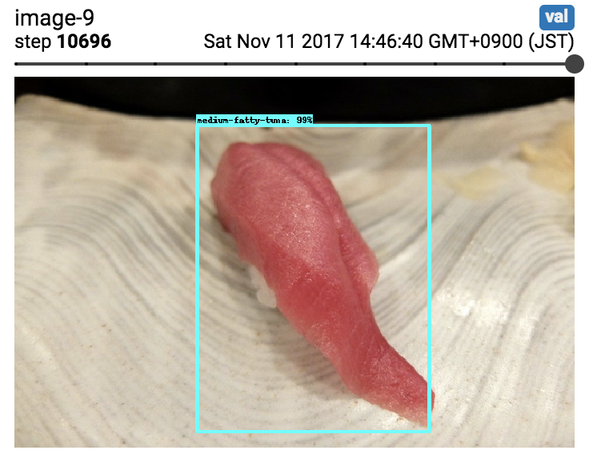
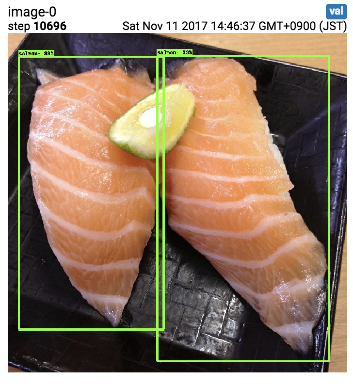
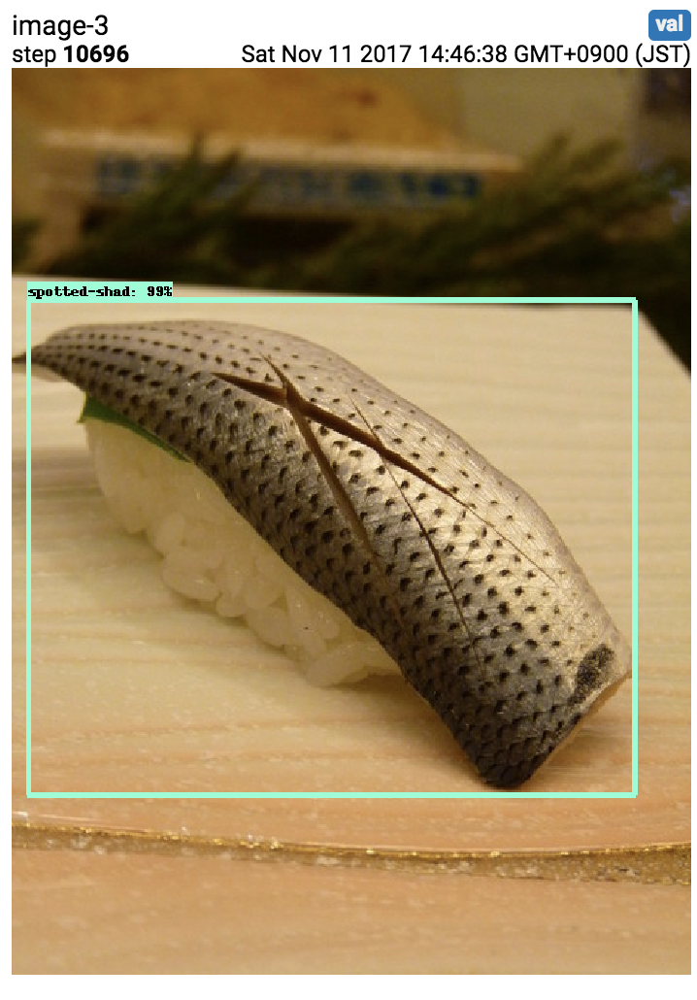

# Tensorflow Sushi Detection
This repository contains sushi dataset and scripts to train custom object detection model using [Tensofrslow Object Detection API](https://github.com/tensorflow/models/tree/master/research/object_detection). Check my blog post ([Japanese](https://qiita.com/watanabe0621/items/0b1cfa2d89c8321767e2)) or [the official document](https://github.com/tensorflow/models/blob/master/research/object_detection/g3doc/using_your_own_dataset.md) for more details.

These are the results I got after training:

|Medium Fatty Tune|Salmon|Spotted Shad|
|---|---|---|
||||


## Data preparation
### Create TFRecord
When you add images and annotations, you need to create TFRecord again.

```
docker run -it \
  --volume `pwd`:/tensorflow \
  floydhub/tensorflow:1.4.0-py3_aws.14 \
  /tensorflow/docker/create_tf_record.sh
```

### Download pretrained model
```
pushd data
pretrained_model=ssd_mobilenet_v1_coco_11_06_2017
curl -OL http://download.tensorflow.org/models/object_detection/${ssd_mobilenet_v1_coco_11_06_2017}.tar.gz
tar -xzf ${pretrained_model}.tar.gz
rm -rf ${pretrained_model}.tar.gz ${pretrained_model}
popd
```

## Run in docker container
### Training
```
docker run -it \
  --volume `pwd`:/tensorflow \
  floydhub/tensorflow:1.4.0-py3_aws.14 \
  /tensorflow/docker/train.sh
```

### Evaluation
```
docker run -it \
  --volume `pwd`:/tensorflow \
  floydhub/tensorflow:1.4.0-py3_aws.14 \
  /tensorflow/docker/eval.sh
```

### Tensorboard
```
tensorboard --logdir=data
open http://localhost:6006
```

### Export a trained model

[Check this document](https://github.com/tensorflow/models/blob/master/research/object_detection/g3doc/exporting_models.md)

```
docker run -it \
  --volume `pwd`:/tensorflow \
  floydhub/tensorflow:1.4.0-py3_aws.14 \
  /bin/bash

> ln -s /tensorflow/data /data
> cd /tensorboard
> ./floyd/setup.sh
> python -m object_detection.export_inference_graph \
    --input_type=image_tensor \
    --pipeline_config_path=/tensorflow/data/ssd_mobilenet_v1_sushi.floyd.config \
    --trained_checkpoint_prefix=/data/train/model.ckpt-${checkpoint_number} \
    --output_directory=/tensorflow/data/output_inference_graph.pb
```

## Run on Floydhub
> Platform-as-a-Service for training and deploying your DL models in the cloud
> [FloydHub - Deep Learning Platform - Cloud GPU](https://www.floydhub.com/)

### Setup
1. Create your floydhub account
2. [Install floyd cli](https://docs.floydhub.com/guides/basics/install/)
3. Create a project

  ```
  floyd init your_project_name
  ```

4. Create dataset 

  ```
  cd data
  floyd data init your_dataset_name
  floyd data upload
  ```

### Training
#### Run from a dataset

```
# CPU
floyd run --env tensorflow-1.4 \
  --data junji/datasets/sushi_detector/1:data \
  "bash ./floyd/setup.sh && cp -R /data/* /output && sh ./floyd/train.sh"

=> junji/projects/sushi_detector/1
```

```
# GPU
floyd run --gpu --env tensorflow-1.4 \
...
```


#### Stop 

```
floyd stop junji/projects/sushi_detector/1
```

#### Run from the output of a past job

```
floyd run --env tensorflow-1.4 \
  --data junji/projects/sushi_detector/{job_id}/output:data \
  "bash ./floyd/setup.sh && cp -R /data/* /output && sh ./floyd/train.sh"

=> junji/projects/sushi_detector/2
```

### Evaluation & Tensorboard

```
floyd run --tensorboard --env tensorflow-1.4 \
  --data junji/projects/sushi_detector/{job_id}/output:data \
  "bash ./floyd/setup.sh && cp -R /data/* /output && nohup sh ./floyd/eval.sh" && tensorboard --logdir=/output

```


## Run on Google Cloud
2017/11/07  
The following steps don't work because Google Cloud ML Engine doesn't support the latest tensorflow version 1.4. Check [this runtime version list](https://cloud.google.com/ml-engine/docs/runtime-version-list).

### Setup
Complete the following step checking the official documents
>
1. Create a GCP project
2. Install the Google Cloud SDK
3. Enable the ML Engine APIs
4. Set up a Google Cloud Storage (GCS) bucket

- [Running on Google Cloud Platform](https://github.com/tensorflow/models/blob/master/research/object_detection/g3doc/running_on_cloud.md)
- [Quick Start: Distributed Training on the Oxford-IIIT Pets Dataset on Google Cloud](https://github.com/tensorflow/models/blob/master/research/object_detection/g3doc/running_pets.md)

### Upload files
```
GCS_BUCKET=your_bucket_name ./gcp/upload_files_to_gcs_bucket.sh
```

We need to package the Tensorflow Object Detection code to run it on Google Cloud, but the custom docker that we are using already has [the packaged code](https://github.com/Jwata/models/blob/master/Dockerfile.object_detectoin)

```
./gcp/get_tensorflow_code_from_docker.sh
```
